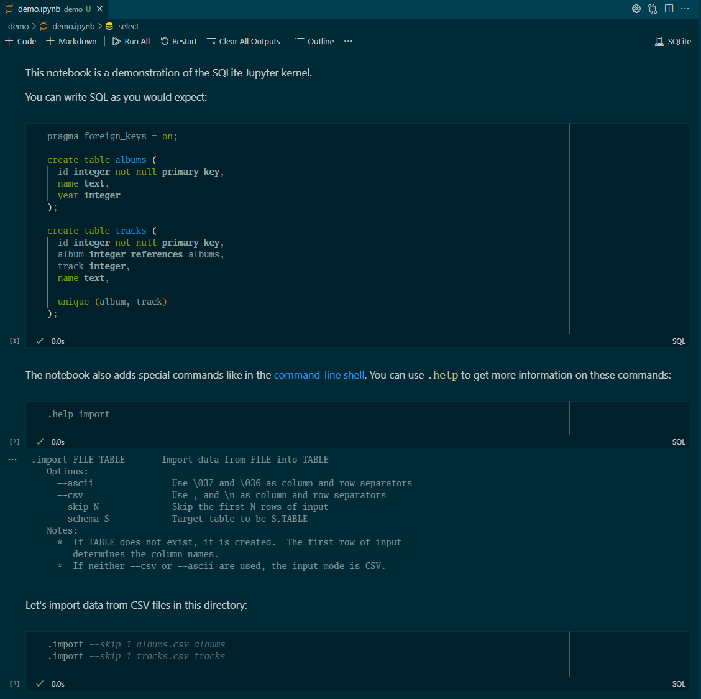

# Jupyter kernel for SQLite

A [Jupyter][] [kernel][] for [SQLite][].
I made this primarily for my personal use, so there may be rough edges.



Check out the [demo notebook][] to see it in action.

Run `.help` to see the additional special commands available.
See the [SQLite syntax reference][] for help with the SQL language.

[demo notebook]: demo/demo.ipynb
[Jupyter]: https://jupyter.org/
[kernel]: https://docs.jupyter.org/en/latest/projects/kernels.html
[SQLite]: https://www.sqlite.org
[SQLite syntax reference]: https://www.sqlite.org/lang.html

## Installation

Preferably, use [Nix][] flakes:

```shell
nix profile install github:zombiezen/sqlite-notebook
```

Make sure that `$HOME/.nix-profile/share/jupyter` is in the [`JUPYTER_PATH`][].
Once installation is complete, SQLite will show up as a kernel that can be used for notebooks.

[`JUPYTER_PATH`]: https://docs.jupyter.org/en/latest/use/jupyter-directories.html#data-files
[Nix]: https://nixos.org/

### Building from source

I only guarantee that this project will build with Nix
(since I can guarantee the libraries are set up consistently),
but if you want to build in a different way, make sure you have the following installed:

- [Rust](https://www.rust-lang.org/) 1.71.1
- [SQLite3](https://www.sqlite.org/index.html) 3.42.0
- [libzmq](https://github.com/zeromq/libzmq) 4.3.4
- [cre2](https://marcomaggi.github.io/docs/cre2.html/) 0.3.6
- [jq](https://jqlang.github.io/jq/)

Then run:

```shell
cargo build --release &&
mkdir -p ~/.local/share/jupyter/kernels/sqlite-notebook &&
bash make_kernel_json.sh target/release/sqlite-notebook > \
  ~/.local/share/jupyter/kernels/sqlite-notebook/kernel.json
```

## Using in Jupyter

Assuming you already have [Jupyter][] installed,
the kernel will show up in Jupyter Notebook.
You can also use `jupyter console --kernel sqlite-notebook` for a CLI REPL.
See the [SQLite syntax reference][]
and run `.help` to see the additional commands available in the notebook.

## Using in Visual Studio Code

You can use this kernel in [Visual Studio Code][] without installing Jupyter.

1. Open the Command Palette (Ctrl-Shift-P, or ⌘-Shift-P on macOS).
2. Search for and select "Create: New Jupyter Notebook".
3. [Open the kernel picker](https://code.visualstudio.com/docs/datascience/jupyter-kernel-management#_jupyter-kernels)
   and select "Jupyter Kernel..." → "SQLite".

[Visual Studio Code]: https://code.visualstudio.com/

## License

[Apache 2.0](LICENSE)
